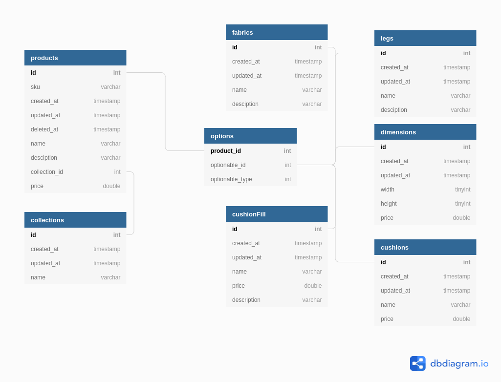

# Practice: Furniture Store

### Database Plan

Going with a many-to-many polymorphic relationship for the options.

https://dbdiagram.io/d/5dafdb3a02e6e93440f286d9



### Setup

1. Create a MySQL database
2. Configure .env (copy .env.example), update `DB_DATABASE` `DB_USERNAME` `DB_PASSWORD` as needed
3. ```
   composer install
   php artisan migrate
   php artisan tinker
   >>> factory('App\Product', 20)->create();
   >>> factory('App\Option', 60)->create();
   ```

### API

As a substitue for proper API documentation, here is my Insomnia export: [insomnia-export.json](docs/insomnia-export.json)


### Roadmap

-   Tests
-   Authentication
-   Admin GUI
-   Follow JSON API standard (error responses and POST responses are currently not up to spec)
-   Add support for PATCH requests
-   Add support for lazy eager loading (e.g. /api/products?include=fabrics:name,description)

### Key Reference Material

-   Laravel
    -   https://laracasts.com/series/build-a-laravel-app-with-tdd/
    -   https://blog.pusher.com/build-rest-api-laravel-api-resources/
    -   https://www.sitepoint.com/what-are-polymorphic-relations-and-how-do-we-use-them-with-eloquent/
    -   https://github.com/Whyounes/eloquent-polymorphism-demo
-   Database Design
    -   https://www.codingblocks.net/programming/database-schema-for-multiple-types-of-products/
    -   https://blog.logrocket.com/polymorphic-relationships-in-laravel/
    -   https://hashrocket.com/blog/posts/modeling-polymorphic-associations-in-a-relational-database
